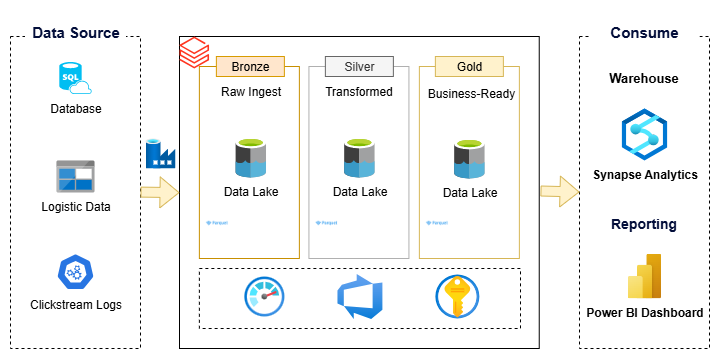

# Retail Data Warehouse on Azure

An end-to-end Azure Data Engineering pipeline for Retail Analytics, built using ADF, Databricks, Synapse, and Power BI.

---

## Project Overview
This project demonstrates the design and implementation of a modern Data Lakehouse pipeline using Azure Data Engineering services. The architecture follows the Medallion (Bronze-Silver-Gold) pattern for data ingestion, transformation, and consumption, enabling scalable and efficient analytics.

The goal of this project is to build a cloud-based data platform that ingests raw data from multiple sources, processes it into structured and curated formats, and makes it available for advanced analytics and reporting.

This end-to-end pipeline showcases:
- Data Ingestion from diverse sources (databases, logs, files).
- Data Storage in Azure Data Lake (Bronze, Silver, Gold zones).
- Orchestration with Azure Data Factory (ADF).
- Data Transformation using Azure Databricks.
- Consumption Layer for analytics with Power BI dashboards.

---

## 🏗️ Architecture
### High Level Architecture

---

## Prerequisites and Setup
Steps to setup this project on the Azure Cloud Portal and be found in the [setup.md](/docs/setup.md).
